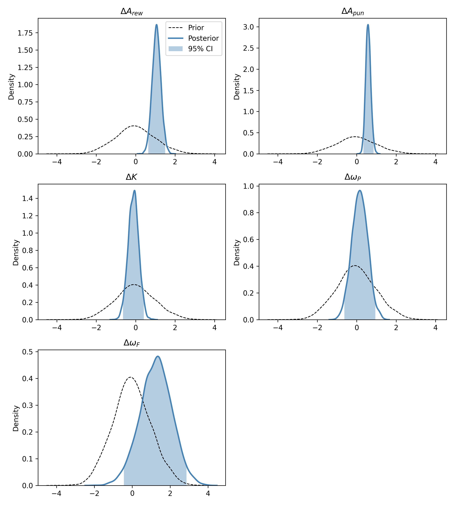

# IGT_dementia
This repository holds the code used for the exam project for decision making (F2023) at Aarhus University. The project investigates differences in decision-making in dementia patients compared to healthy controls using the Iowa Gambling Task (IGT) and the Outcome Representation Learning (ORL) model.

## Data and reproducibility
The data used for this project, was graciously provided by xxxx and xxxx. The data is not publicly available, and therefore not included in this repository. As the data is not available in this repository, the parameter estimation pipeline cannot be replicated. However, all needed files for the parameter recovery pipeline are available. The bash scripts in the `parameter_recovery` directory can be used to run the parameter recovery pipeline.
